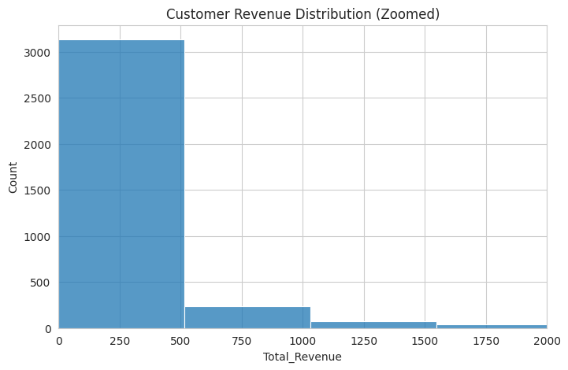
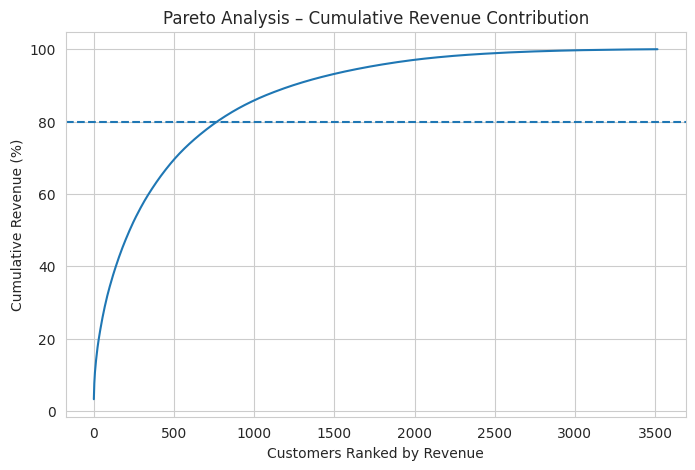
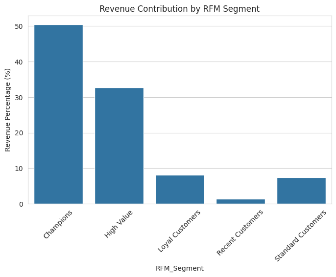

# Customer Segmentation & Revenue Analysis (RFM Model)

## Project Overview

This project analyzes retail transaction data to identify high-value customers using **RFM segmentation (Recency, Frequency, Monetary)** and **Pareto analysis (80/20 rule)**.

The objective is to understand customer purchasing behaviour and identify which customer segments contribute the most revenue, enabling businesses to design targeted marketing and retention strategies.

---

## Business Problem

Retail businesses often have thousands of customers, but only a small percentage generate the majority of revenue. Understanding **customer value distribution** is critical for:

* Targeted marketing campaigns
* Customer retention strategies
* Revenue optimization
* Identifying high-value customers

This project addresses this challenge by applying **RFM analysis and Pareto analysis** to customer transaction data.

---

## Dataset

The dataset contains retail transaction records including:

* Invoice ID
* Customer ID
* Product Description
* Quantity
* Price
* Invoice Date
* Country

Total transactions analyzed: **20,000+ records**

Customer-level metrics were created by aggregating transaction data.

---

## Analysis Workflow

### 1. Data Cleaning & Preprocessing

* Removed missing values
* Converted date columns
* Calculated revenue per transaction

### 2. Customer-Level Aggregation

Transactions were grouped by **Customer_ID** to calculate:

* Total Revenue
* Total Orders
* Total Quantity Purchased
* First Purchase Date
* Last Purchase Date

### 3. Revenue Distribution Analysis

The distribution of customer revenue was analyzed to understand how revenue is spread across the customer base.

Key observation:
Revenue distribution is **heavily right-skewed**, meaning a small number of customers generate most of the revenue.

---

### 4. Pareto Analysis (80/20 Rule)

Customers were ranked based on revenue contribution and cumulative revenue percentage was calculated.

Results showed that:

* **Top ~20–25% of customers contribute ~80% of total revenue**

This confirms the presence of strong **Pareto behaviour** in the dataset.

---

### 5. RFM Segmentation

Customers were segmented using the **RFM framework**:

* **Recency** – How recently the customer made a purchase
* **Frequency** – How often the customer purchases
* **Monetary** – How much the customer spends

Customers were classified into segments such as:

* Champions
* High Value
* Loyal Customers
* Standard Customers
* Recent Customers

---

## Key Insights

* **Champion customers contribute ~50% of total revenue**
* **Top 20–25% of customers generate ~80% of revenue**
* Majority of customers fall into **lower revenue segments**
* Customer value distribution is highly concentrated among a small group

These findings highlight the importance of focusing on **high-value customer retention and engagement strategies**.

---

## Visualizations

### Customer Revenue Distribution



---

### Pareto Revenue Curve



---

### Revenue Contribution by RFM Segment



---

## Technologies Used

* **Python**
* **Pandas**
* **NumPy**
* **Matplotlib**
* **Seaborn**
* **Jupyter Notebook / Google Colab**

---

## Project Structure

```
customer-segmentation-rfm-analysis
│
├── data
│   └── sample_dataset.csv
│
├── images
│   ├── revenue_distribution.png
│   ├── pareto_curve.png
│   └── rfm_segment_revenue.png
│
├── notebooks
│   └── rfm_customer_analysis.ipynb
│
├── README.md
└── .gitignore
```

---

## Business Impact

This analysis helps businesses:

* Identify **high-value customers**
* Improve **targeted marketing strategies**
* Optimize **customer retention programs**
* Understand **revenue concentration risk**

---

## Future Improvements

Possible extensions of this project include:

* Customer Lifetime Value (CLV) prediction
* Churn prediction models
* Integration with marketing campaign data
* Automated customer segmentation pipelines

---

# What This Shows (For Recruiters)

This project demonstrates:

* Customer analytics
* Data cleaning and transformation
* Business insight generation
* Statistical analysis
* Data visualization
* End-to-end data analysis workflow

---
